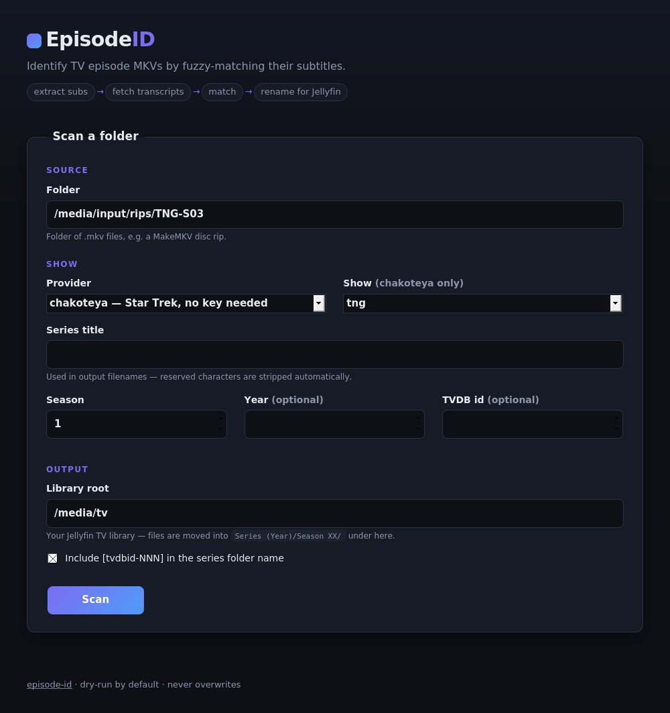
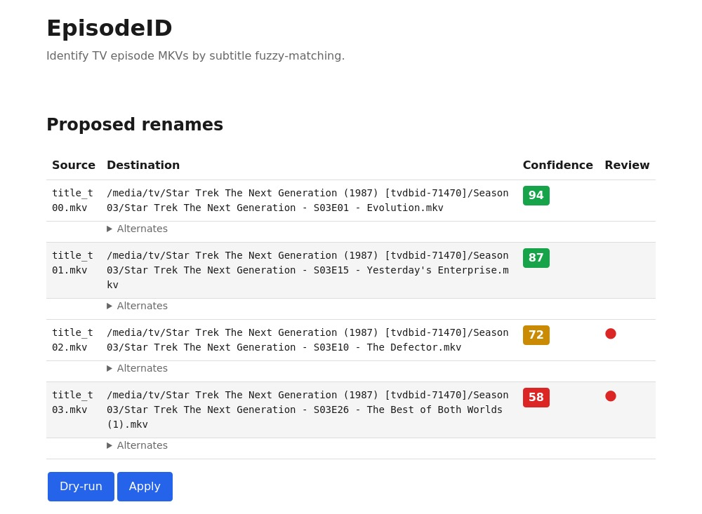
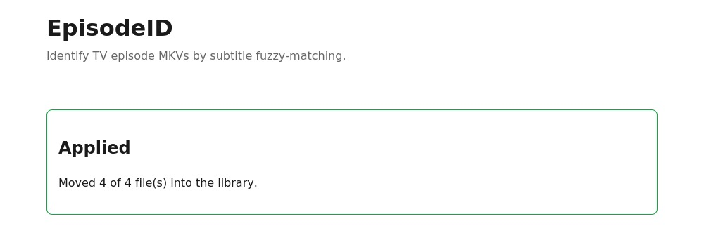

# EpisodeID

[](https://github.com/arthurbenemann/episode-id/actions/workflows/ci.yml)

Identify TV episode MKVs by fuzzy-matching their embedded subtitles against
canonical transcripts, then rename them into a
[Jellyfin-compatible layout](https://jellyfin.org/docs/general/server/media/shows/).

Built for the case where MakeMKV (or any disc ripper) emits files like
`title_t00.mkv`, `title_t04.mkv`, … in random order and you don't want to
play each one to figure out which episode it is.

## Features

- **Subtitle fingerprinting** — extracts the best English text track with
  ffmpeg (or OCRs image-based PGS tracks from Blu-ray rips via Tesseract),
  fuzzy-matches dialogue against reference transcripts (`rapidfuzz` +
  Hungarian assignment, so two files can't claim the same episode).
- **Jellyfin-ready renames** — `Series (Year) [tvdbid-NNN]/Season XX/…`,
  reserved characters stripped, dry-run by default, never overwrites.
- **Web UI** — scan a folder, watch progress, review confidence-scored
  proposals, apply behind a confirm dialog. Plain HTML + htmx, no build
  step.
- **Two transcript providers** — chakoteya.net for Star Trek (no key
  needed) and OpenSubtitles for everything else (free API key).
- **SQLite transcript cache** — OpenSubtitles downloads are quota-limited,
  so fetched transcripts are cached and re-scans never re-download.
- **Jellyfin auto-rescan** — set `JELLYFIN_URL` + `JELLYFIN_API_KEY` and a
  library scan fires automatically after every successful Apply.
- **One Docker image** — web UI by default, CLI included.

## Screenshots

| Scan form | Proposed renames | Applied |
| --- | --- | --- |
|  |  |  |

## How it works

1. Extract the best English subtitle track from each MKV (`ffmpeg`).
2. Fetch canonical transcripts for the selected show + season from a
   provider, caching them in SQLite.
3. Fuzzy-match a dialogue sample from each file (default: 40 lines starting
   3 minutes in, past cold opens and recaps) against every candidate
   episode.
4. Solve the globally optimal file → episode assignment with the Hungarian
   algorithm.
5. Propose renames with per-file confidence; you review and apply.

## Run it

Requires Docker (or Podman) with compose support.

```bash
git clone https://github.com/arthurbenemann/episode-id.git
cd episode-id
docker compose up -d --build
```

Open <http://localhost:8080>. Drop your rips in `./media/input`
(subfolders are scanned recursively, so a per-disc ARM/MakeMKV layout
works as-is) and point `./media/tv` at your Jellyfin TV library (override either with
`MEDIA_INPUT` / `LIBRARY_ROOT`). The transcript cache persists in
`./data/`.

Pre-built images are published to `ghcr.io/arthurbenemann/episode-id` on
each release.

To override settings, copy `.env.example` to `.env` and recreate the
container — every variable is documented inline. The one you'll likely
want: `OPENSUBTITLES_API_KEY` (free from
[opensubtitles.com/consumers](https://www.opensubtitles.com/consumers))
unlocks the OpenSubtitles provider for shows beyond Star Trek.

### CLI

The same pipeline ships as a CLI in the image:

```bash
docker run --rm --entrypoint episode-id \
    -v ~/rips/TNG-S03:/media/input \
    -v /path/to/tv:/media/tv \
    ghcr.io/arthurbenemann/episode-id \
    --folder /media/input --show tng --season 3 \
    --series-title "Star Trek The Next Generation" --year 1987 --tvdb-id 71470
```

Dry-run by default; add `--apply` to move files. Use
`--provider opensubtitles --tvdb-id <id>` for non-Trek shows
(`-e OPENSUBTITLES_API_KEY=…`).

### JSON API

Everything the UI does is also plain HTTP — `POST /scan`,
`GET /jobs/{id}`, `GET /jobs/{id}/results`, `POST /jobs/{id}/apply`
(`{"confirm": true}` to actually move). Interactive docs at
<http://localhost:8080/docs>.

## Roadmap

- [x] **M1** — CLI prototype with Chakoteya provider and Jellyfin renamer
- [x] **M2** — FastAPI wrapper around the same logic
- [x] **M3** — htmx web UI
- [x] **M4** — OpenSubtitles provider (works beyond Trek)
- [x] **M5** — PGS OCR for Blu-ray rips without text subs (VobSub/DVD still TODO)
- [x] **M6** — CI/CD release pipeline publishing to ghcr.io

See [docs/SPEC.md](docs/SPEC.md) for the full design.

## Contributing

See [CONTRIBUTING.md](CONTRIBUTING.md) for local setup, the test suite,
and the release flow.

## License

MIT — see [LICENSE](LICENSE).
